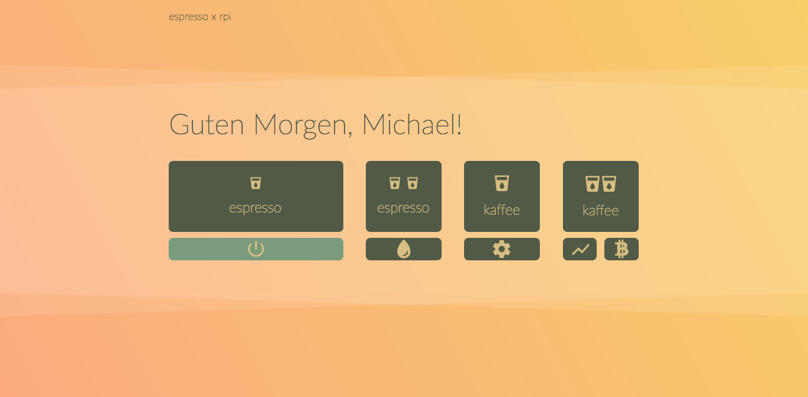

# RPiCoffee

This project's goal is to make a coffee machine responsive to different HTTP-Requests, like:

**JSON-Request**
```json
{
  "userID": "admin",
  "actions": [
    "turn on",
    "brew espresso"
  ]
}

```
'Cause nobody likes to wait for the machine.

**Possible scenarios are:**
- turn on and shutting down the machine via HTTP-request
- brewing single and double espresso via HTTP-request
- brewing single and double coffee via HTTP-request
- starting the rinse program via HTTP-request (good for preheating the system)
- chaining simple actions like in the example above
- reading out machine status (e.g. water level, coffee bean depot, temperature, errors, ...)
- rendering a responsive web-app for better user experience
- data logging and visualisation in the web-app

## Progress / ToDo

[x] Soldering jumper wires to all of the frontpanel buttons

[x] First Prototype for web app

[x] Rework on the wire management

[x] Design and order interface PCB

[ ] Solder the interface circuit

[ ] Practice SMD soldering maybe order some SMD solder tips

[x] First prototype of the interface circuit
 
[x] First espresso via webbrowser

[ ] Checkout the positions of relevant sensors (water, coffe grounds level) for direct access

[x] Find a way to read out LEDs at the frontpanel

[X] Redesign User-interface

### Intro ###
The easiest way is to hack the existing frontpanel via overriding its pushbuttons. The HTTP-stuff can be handled by a microcontroller with a wifi-shield or a microcomputer like the the RaspberryPi Zero W which has built-in wifi.

I will stick to the Raspberry because it is cheap (around 12 Eur for the Zero W) and I do not have to make any hardware modifications to get it up and running. The Raspberry will be prepared with a minimal setup based on Raspbian Lite with everything unnecessary turned off. 

It's described in this article: [https://www.heise.de/ct/ausgabe/2017-22-Digitales-Flugblatt-Raspberry-Pi-mit-Batterie-als-anonymer-WLAN-Hotspot-und-Webserver-3851689.html](https://www.heise.de/ct/ausgabe/2017-22-Digitales-Flugblatt-Raspberry-Pi-mit-Batterie-als-anonymer-WLAN-Hotspot-und-Webserver-3851689.html)

The RPi will be powered by its own USB-power supply because I do not know how stable the coffee machines DC rails. Maybe later I will parallel the 230V rails of the coffee machine to the Raspberry's AC power supply.

On the RPi there will be running Flask for the HTTP-stuff and maybe a mongodb database for some data collecting.


### Mobile / Responsive User Interface stuff


#### Second iteration: WebApp-UI
I made a rededign of the UI because I did not like the dark theme (see below). I began prototyping the complete thing in Sketch and transfered it later to HTML and CSS with the help of Skeleton ([getskeleton.com](http://www.getskeleton.com)) and Sketch's CSS and SVG output-features. 

I picked a nice morning like gradient from [webgradients.com](http://webgradients.com) and played around with colorsets from [coolors.co]. For the final touch I added these transparent triangle things for some foggy morning effects. They are technically stacked CSS3 clipping paths of div-elements I colored with #fff and alpha = 0.2 ;-)

The icons are this time from Google's material design icon-font ([https://material.io/icons/](https://material.io/icons/)) I found them via the awesome iconfont plugin for Sketch by Kerem Sevencan ([https://github.com/keremciu](https://github.com/keremciu))

All the hover interaction-stuff and responsiveness is finished. Everything else (settings, stats and cryptomining😅) will be added iteratively as soon as main functionalities are up and running.




Everything was uploaded to my github-repo at the UI path.

#### First iteration: WebApp-UI
Some time ago I put together a simple UI-prototype for the planned web app. It will be rendered by a Flask Webserver on the raspberry. The interface should be responsive and useable on mobile and desktop browsers. I will use the skeleton CSS-only-framework for the responsiveness.

I used flaticons.com to find some nice icons (see credits below the images). As soon as the technical stuff is working, I will do a redesign with my own icons and update everything to the state actually implemented.

Here are some impressions of the first iteration:


**Credits for the nice icons:**

Icon made by Freepik from [www.flaticon.com] (coffee cup)

Icon made by Creaticca Creative Agency from [www.flaticon.com] (shower)

Icon made by Smashicons from [www.flaticon.com] (pie chart, settings)

### Electromechanical stuff

Finally I designed the PCB of the interface circuit. Luckily oshpark has a good documentation for accepted PCB-files from different softwares, so I picked one of these softwares. After some youtube-videos I was able to design my PCB in KiCad.
Despite of rearranging everything nicely there aren't any big changes to the prototyped circuit. In my final iteration of the PCB, I changed the resistors and transistors to SMD parts. Otherwise the cost for my order would have been doubled. Now it is 12$ for three PCBs

 


I don't know if I am able to solder SMD parts with my big solder tip, maybe I will order some smaller ones.

Also I got some meters of enamelled copper wire to replace the quite thick wires I soldered to the interface before.


I used the 0.3mm one. Now there is nothing interfering with the buttons anymore and the diameter is smaller than the SMD parts on the circuit. Everything fine!

The soldering looks a little bit messy because I like to use a lot of flux.


Now it looks much cleaner than before. I taped the wires to the original flat cable to enhance the sturdiness of the cable harness.


That is the actual side-view right now. I won some space because of the better cable management, but in general it looks like before.


First espresso via webbrowser! Sorry for the jumpy filming, was a little bit excited :-D


Setting GPIO Pins via webbrowser with Flask. The Raspberry Pi and the laptop are connected to my local wlan:


Yesterday I got my order of optocouplers, transistors and other stuff. I made a litte circuit to drive two channels / switches via GPIO Pins. So it can control two buttons. For my tests I connected them to the power button and the espresso button. The final layout will be produced by some PCB manufacturer.


First test of the hacked frontpanel via "hotwiring" the buttons:


Here is the place where the Raspberry Pi and the interface circuit is planned to stay at. This looks like a safe place for electronics (you have to be aware of humidity) because the mainboard of the machine is placed there, too.


There is a hole for the original flat wire which is big enough for my hacked wires.


I will have to rework the running of the wires a little bit because right now the button press feels softer than before. Meaning, the wires are pressed down by the plastic grid, eventually causing damage to the isolation in the future.


First step is finished with soldering jumper cables to every switch. I planned to do the same with the LEDs for reading out the machine's status and errors but the SMD-LEDs are pretty small and my solder tip seemed to big for proper soldering. You can see them some of them (DL3 - DL5) in the first row of the circuit board.

The frontpanel looked very spacious at first, but there is a grid of plastic under the buttons giving minimal space for running the wires. This plastic construction is for transfering the mechanical force to the actual pushbuttons on the circuit and manages to transfer the light of the SMD-LEDs to the front. So if you really mess up, the buttons stop working, the LED's light will be blocked and the case of the frontpanel will not close anyway. You could cut the grid a little bit, but I wanted to modify the machine as little as possible.


